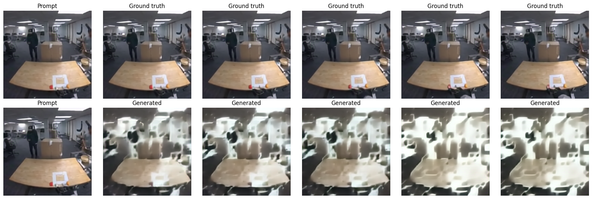
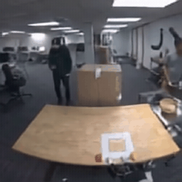
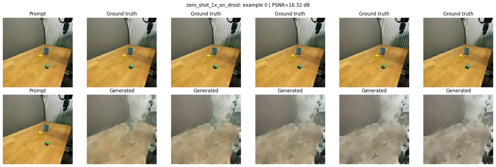
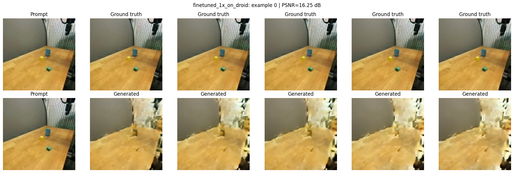

# Humanoid World Model - Masked-HWM Reimplementation

This repository contains our course-project reimplementation and adaptation of
the **Masked Humanoid World Model (Masked-HWM)** pipeline from the original
Humanoid World Model project.

Our focus is not a full paper-scale replication. Instead, we study whether the
lightweight **discrete-token Masked-HWM paradigm** remains usable under
small-lab compute and cross-dataset domain shift.

Upstream project: https://github.com/qasim-ali0/humanoid_world_model

Project page used for comparison: https://qasim-ali0.github.io/projects/humanoid_world_model/

---

## What We Implemented

Our implementation centers on three Kaggle notebooks in [`notebooks/`](notebooks):

| Notebook | Purpose |
|---|---|
| [`Training.ipynb`](notebooks/Training.ipynb) | Kaggle-ready 1XGPT training and inference for visual-only Masked-HWM |
| [`Novel_dataset_preparation.ipynb`](notebooks/Novel_dataset_preparation.ipynb) | Preprocess raw DROID robot videos/RLDS data into the 1X-style tokenized format |
| [`Finetuning.ipynb`](notebooks/Finetuning.ipynb) | Zero-shot inference on DROID and DROID fine-tuning from a 1X-trained checkpoint |

The main implementation decisions are:

- **Model family:** Masked-HWM only.
- **Tokenizer:** Cosmos `DV8x8x8`.
- **Training target:** discrete VQ codebook IDs, not RGB pixels.
- **Temporal config:** `T=3`, `num_prompt_frames=1`.
- **Prediction contract:** `z0` is visible prompt; `z1,z2` are future latent tokens to generate.
- **Decoded rollout:** `(z0,z1,z2)` decodes into a 17-frame RGB video.
- **Action conditioning:** disabled with `WITH_ACT=False`, so the model is visual-only.
- **Compute setting:** Kaggle GPU sessions with bounded runs.

---

## Pipeline Overview

```text
17 RGB frames
    -> Cosmos DV8x8x8 tokenizer
    -> latent tokens with shape (3, 32, 32)
    -> keep z0 as prompt and mask z1,z2
    -> Masked-HWM Transformer predicts future codebook IDs
    -> Cosmos decoder reconstructs a 17-frame rollout
```

Training uses cross-entropy over masked future token positions:

```text
L(theta) = - 1 / |M| * sum_{i in M} log p_theta(y_i | x_masked)
```

where `M` is the set of masked future-token positions and `y_i` is the
ground-truth Cosmos VQ codebook ID.

---

## Results

### 1XGPT In-Domain Rollout

The model is prompted with the first decoded frame/latent context and generates
future latent tokens, which are decoded back to RGB frames.



Prediction GIF:



### DROID Zero-Shot and Fine-Tuned Rollouts

We preprocess DROID into the same visual-token format, then evaluate a 1X-trained
checkpoint directly on DROID and after short DROID fine-tuning.

**Zero-shot 1X checkpoint on DROID**



**DROID fine-tuned checkpoint**



### Quantitative DROID Summary

The following numbers are from `Finetuning.ipynb` over four paired DROID
examples. They are intended as a small-scale adaptation check, not a full
benchmark.

| Stage | Mean MSE ↓ | Mean PSNR ↑ |
|---|---:|---:|
| 1X checkpoint zero-shot on DROID | 0.04285 | 14.67 dB |
| 1X checkpoint fine-tuned on DROID | 0.03571 | 15.38 dB |
| Delta after fine-tuning | -0.00714 | +0.71 dB |

The fine-tuned model improves the average PSNR on this small DROID sample, while
qualitative outputs still show common world-model failure modes: blurred small
objects, unstable robot geometry, and weak interaction dynamics under domain
shift.

---

## Dataset Preparation

The original 1X-style dataset is already tokenized, so the training notebook can
read:

```text
train_v2.0/
  metadata.json
  metadata/metadata_*.json
  videos/video_*.bin
  segment_indices/segment_idx_*.bin

val_v2.0/
  ...
```

DROID is different: it starts as raw robot videos/RLDS episodes. We convert it
into the same tokenized contract:

```text
DROID RLDS episodes
    -> choose RGB camera stream
    -> resize/crop frames
    -> 17-frame clips
    -> Cosmos encoder.jit
    -> token chunks with shape (3,32,32)
    -> 1X-style train_v2.0 / val_v2.0 folders
```

Because DROID does not provide the same 1X-format `robot_states`, all DROID
training and inference in this project uses:

```python
WITH_ACT = False
```

---

## BridgeData V2 Plan

At the current project stage, DROID is the completed novel dataset. BridgeData
V2 is the second target dataset, but it has not yet been fully processed or
fine-tuned in this artifact.

The proposed BridgeData V2 solution is to reuse the DROID preprocessing contract:

1. Load BridgeData V2 trajectories.
2. Select a consistent camera stream, preferably the main external or wrist view.
3. Convert frames to RGB and resize/crop to the tokenizer input size.
4. Split each trajectory into 17-frame clips.
5. Encode clips with Cosmos `encoder.jit` into `(3,32,32)` token chunks.
6. Write the same 1X-style folder structure:

```text
bridge_hwm_tokenized/
  train_v2.0/
    metadata.json
    metadata/metadata_0.json
    videos/video_0.bin
    segment_indices/segment_idx_0.bin
  val_v2.0/
    ...
```

7. Verify compatibility with the same loader used for 1XGPT and DROID.
8. Run zero-shot inference and a bounded fine-tuning pass with `WITH_ACT=False`.

For details, see [`docs/BRIDGEDATA_V2_PLAN.md`](docs/BRIDGEDATA_V2_PLAN.md).

---

## Repository Contents

```text
Masked-HWM/
  notebooks/
    Training.ipynb
    Novel_dataset_preparation.ipynb
    Finetuning.ipynb
    paper.pdf
  docs/
    media/
      extracted rollout PNG/GIF artifacts
    BRIDGEDATA_V2_PLAN.md
  genie/
  magvit2/
  train.py
  data.py
  README.md
```

Large local datasets, checkpoints, tokenizer weights, and Kaggle outputs are
excluded from Git. They should be added through Kaggle datasets or downloaded
separately.

---

## Running The Notebooks

The notebooks are designed for Kaggle:

1. Add the 1X-style tokenized world-model dataset as a Kaggle input.
2. Add the Cosmos tokenizer checkpoint/dataset containing `encoder.jit` and
   `decoder.jit`.
3. Run [`Training.ipynb`](notebooks/Training.ipynb) to train/infer on 1XGPT.
4. Run [`Novel_dataset_preparation.ipynb`](notebooks/Novel_dataset_preparation.ipynb)
   to produce a DROID tokenized dataset.
5. Upload the tokenized DROID output as a Kaggle dataset.
6. Run [`Finetuning.ipynb`](notebooks/Finetuning.ipynb) for DROID zero-shot and
   fine-tuning.

---

## Limitations

- This is a **Masked-HWM-only** reproduction; Flow-HWM is not reproduced.
- The current adaptation path is **visual-only**; action conditioning is disabled.
- DROID and BridgeData V2 are robot manipulation datasets, not true humanoid
  egocentric datasets.
- The reported DROID numbers are small-sample notebook results, not a full
  paper-scale benchmark.
- BridgeData V2 remains a planned extension unless the preprocessing and
  fine-tuning notebooks are executed on that dataset.

---

## Citation

If you use the original HWM method or code, please cite the upstream authors and
their repository/project page. This repository is a course-project adaptation
built on top of their released code.
